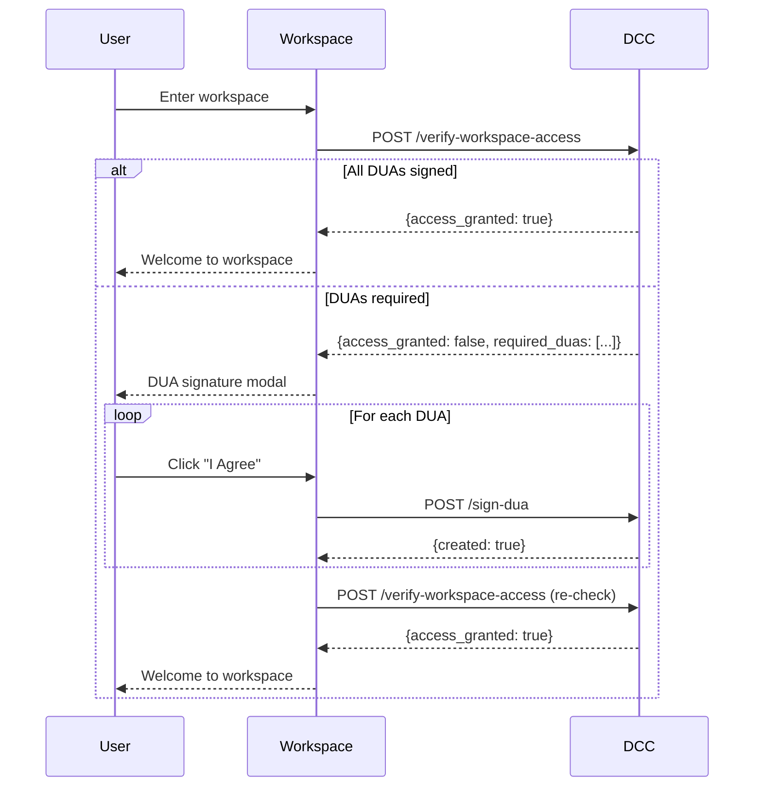

# DCC Project - Azure DevOps Work Items

> **Project:** Dataset Contracts & Controls (DCC) - RBAC Enhancement
> **Date Created:** May 6, 2026
> **Status:** Phase 1 Complete, Phases 2-4 Pending

---

## Table of Contents

1. [Epic Overview](#epic-overview)
2. [Epic 1: DIS Backend Development](#epic-1-dis-backend-development)
3. [Epic 2: Catalog Integration](#epic-2-catalog-integration)
4. [Epic 3: Workspace Integration](#epic-3-workspace-integration)
5. [Epic 4: Testing & Deployment](#epic-4-testing--deployment)
6. [Dependencies](#dependencies)

---

## Epic Overview

| Epic ID | Epic Name | Status | Owner |
|---------|-----------|--------|-------|
| EPIC-001 | DIS Backend Development | ✅ Done | DIS Team |
| EPIC-002 | Catalog Integration | 🔵 Not Started | Catalog Team |
| EPIC-003 | Workspace Integration | 🔵 Not Started | Workspace Team |
| EPIC-004 | Testing & Deployment | 🔵 Not Started | QA + DevOps Teams |

**Status Legend:** ✅ Done | 🟢 In Progress | 🔵 Not Started | ⚠️ Blocked

---

## Epic 1: DIS Backend Development

**Epic ID:** EPIC-001
**Status:** ✅ Done
**Owner:** DIS Backend Team
**Dependencies:** None

### Description
Implement core DCC functionality in DIS: database tables, API endpoints, business logic, and testing.

### Acceptance Criteria
- [x] 6 database tables created with Alembic migrations
- [x] 6 API endpoints implemented (register-dataset, approve-dar, sign-dua, verify-workspace-access, get-airlock-reviewers, audit-logs)
- [x] Helper functions and operations layer following async patterns
- [x] 65+ unit tests passing (helpers, operations, audit)
- [x] API documentation complete (Swagger/OpenAPI)
- [x] Architecture and developer documentation updated

### User Stories

#### US-001-01: Database Schema Implementation
**Status:** ✅ Done
**Priority:** High

**As a** DIS developer
**I want to** create database tables for DCC functionality
**So that** I can store dataset contracts, DUA signatures, and audit logs

**Acceptance Criteria:**
- [x] Tables: datasets, dataset_airlock_reviewers, dataset_workspace_approvals, dua_signatures, audit_logs, system_settings
- [x] Proper constraints, indexes, and foreign keys
- [x] Alembic migration scripts with rollback
- [x] Schema documentation updated

---

#### US-001-02: API Endpoint Implementation
**Status:** ✅ Done
**Priority:** High

**As an** external service (Catalog/Workspace)
**I want to** call DIS APIs to manage DCC workflows
**So that** I can enforce dataset contracts and controls

**Acceptance Criteria:**
- [x] All 6 endpoints with Pydantic models
- [x] X-API-Key authentication (2-tier: Platform + Admin)
- [x] Input validation and error handling
- [x] All endpoints tested
- [x] OpenAPI documentation

---

#### US-001-03: Business Logic & Operations Layer
**Status:** ✅ Done
**Priority:** High

**As a** DIS developer
**I want to** implement helper functions and operations following async patterns
**So that** code is clean, testable, and consistent with the codebase

**Acceptance Criteria:**
- [x] Helper functions (dcc_helpers.py) - all async
- [x] Audit logging (dcc_audit.py) - all async
- [x] Operations layer (operations.py) - session management, async
- [x] SQLAlchemy ORM models
- [x] Unit tests (30 helpers + 14 operations + 21 audit = 65 tests)

---

#### US-001-04: Documentation
**Status:** ✅ Done
**Priority:** High

**As a** developer/operator
**I want to** comprehensive documentation
**So that** I can understand and maintain the system

**Acceptance Criteria:**
- [x] API_REFERENCE.md (wire-level specs for 6 endpoints)
- [x] ARCHITECTURE.md (Section 11: DCC Architecture)
- [x] DEVELOPER_INSTRUCTIONS.md (operational guide)
- [x] SCHEMA.md (database schema)

---

## Epic 2: Catalog Integration

**Epic ID:** EPIC-002
**Status:** 🔵 Not Started
**Owner:** Catalog Team
**Dependencies:** EPIC-001 (DIS APIs must be available)

### Description
Integrate DCC functionality into Catalog: update dataset registration form, implement DAR approval hooks, provision IDP users, and create email templates.

### Acceptance Criteria
- [ ] Dataset registration form includes DCC section with validation
- [ ] DIS API called on dataset save (with retry logic)
- [ ] DAR approval triggers both DIS APIs (approve-dar, sign-dua)
- [ ] Third-party reviewers provisioned in IDP with correct role
- [ ] Email templates created and tested (2 templates)
- [ ] Integration tests passing

### User Stories

#### US-002-01: Update Dataset Registration Form
**Status:** 🔵 Not Started
**Priority:** High

**As a** dataset owner
**I want to** specify additional contracts and controls
**So that** my dataset has proper access requirements

**Technical Context:**
- The form extends the existing dataset registration with a collapsible "Additional Dataset Contracts & Controls" panel
- Panel visibility controlled by "Additional T&Cs?" toggle (Yes/No)
- Supports multiple DUAs per dataset (added May 2026)
- Each DUA requires: title, description, scope, type, and link

**Form Layout:**
```
┌─ Additional Dataset Contracts & Controls ─────────┐
│  Additional T&Cs?      ( ) No   (•) Yes           │
│                                                   │
│  ── Data Use Agreements (DUAs) ─────────────────  │
│  Require DUA?          (•) Yes   ( ) No           │
│                                                   │
│  ┌─ DUA #1 ─────────────────────────────────────┐│
│  │ Title:       [Primary Data Use Agreement   ] ││
│  │ Description: [Standard terms for access    ] ││
│  │ Type:        [Click ▼] (only "Click")       ││
│  │ Link:        [https://...                  ] ││
│  │ Scope:       (•) Per user                    ││
│  │              ( ) Per domain/org              ││
│  │                           [Remove DUA #1]    ││
│  └─────────────────────────────────────────────┘│
│  [+ Add Another DUA]                             │
│                                                   │
│  ── Airlock ──────────────────────────────────   │
│  Require airlock approval? (•) Yes   ( ) No      │
│  Reviewer emails: [email1@x.com;email2@y.com   ] │
│                   (semicolon-separated)          │
└───────────────────────────────────────────────────┘
```

**Acceptance Criteria:**

**Form Structure:**
- [ ] Collapsible panel triggered by "Additional T&Cs?" toggle
- [ ] Panel hidden and not submitted when "Additional T&Cs = No"
- [ ] DUA section with "Require DUA?" toggle
- [ ] Airlock section with "Require airlock approval?" toggle
- [ ] Dynamic DUA management: Add/Remove DUA buttons

**Field Specifications (Per DUA):**
- [ ] **DUA Title**: Text input, required when DUA=Yes, max 200 chars
- [ ] **DUA Description**: Textarea, required when DUA=Yes, max 1000 chars
- [ ] **DUA Scope**: Radio buttons - "Per user" or "Per domain/org", required
- [ ] **DUA Type**: Dropdown - only "Click" available today, required
- [ ] **DUA Link**: URL input, required, must be https://, validated via server-side HEAD request
- [ ] **Airlock Reviewer Emails**: Textarea, semicolon-separated, max 50 reviewers

**Client-Side Validation:**
- [ ] URL format validation (must be https://)
- [ ] Email format validation (RFC 5322 compliant)
- [ ] Duplicate email detection and removal
- [ ] Character limits enforced (title 200 chars, description 1000 chars)
- [ ] At least one DUA required when "Require DUA = Yes"
- [ ] All DUA fields required when DUA is added

**Server-Side Validation:**
- [ ] Pre-flight HEAD request to DUA link (must return 2xx)
- [ ] Reject form if DUA link is unreachable
- [ ] Email syntax validation
- [ ] Max 50 reviewer emails enforced

**Form State Management:**
- [ ] Show/hide panel based on toggle state
- [ ] Preserve form state on validation errors
- [ ] Pre-populate fields when editing existing dataset
- [ ] Support adding/removing multiple DUAs dynamically
- [ ] Clear DUA fields when "Require DUA = No"

**Edit Semantics:**
- [ ] Pre-populate from current dataset version
- [ ] Re-registration creates new version in DCC
- [ ] Display version history link (optional)

---

#### US-002-02: Integrate DIS API on Dataset Save
**Status:** 🔵 Not Started
**Priority:** High

**As a** dataset owner
**I want to** my DCC information saved to DIS
**So that** access controls are enforced

**Technical Context:**
- Called only when "Additional T&Cs = Yes"
- Skip DCC call entirely when panel is disabled
- API endpoint: `POST /api/dis/v1/dcc/dataset-registration`
- Authentication: X-API-Key header (Platform API Key from Azure Key Vault)
- Idempotent: Multiple calls for same dataset_id create new versions

**Request Payload Example:**
```json
{
  "email_address": "owner@example.com",
  "dataset_id": "db3345",
  "additional_dua": true,
  "duas": [
    {
      "dua_title": "Primary Data Use Agreement",
      "dua_description": "Standard terms for dataset access",
      "dua_scope": "per_user",
      "dua_type": "click",
      "dua_link": "https://example.com/dua1.pdf"
    },
    {
      "dua_title": "Secondary Agreement",
      "dua_description": "Additional sensitive data terms",
      "dua_scope": "per_domain_org",
      "dua_type": "click",
      "dua_link": "https://example.com/dua2.pdf"
    }
  ],
  "airlock_approve": true,
  "airlock_emails": "reviewer1@x.com;reviewer2@y.com"
}
```

**Response Handling:**
- **200 OK**: Success - display "Dataset saved (version N)" message
- **400 MISSING_FIELD/INVALID_FIELD**: Bug in Catalog - log error, display to user, DO NOT retry
- **401 UNAUTHORIZED**: X-API-Key wrong - alert operator, queue for replay
- **403 FORBIDDEN_IP**: Network drift - alert operator, queue for replay
- **5xx**: Transient error - retry with exponential backoff

**Acceptance Criteria:**

**DIS API Client Module:**
- [ ] Reusable API client class/module for DCC endpoints
- [ ] X-API-Key loaded from Azure Key Vault at startup
- [ ] Managed identity authentication to Key Vault
- [ ] Key Vault secret name: `dcc-platform-api-key`
- [ ] Client handles HTTP/HTTPS requests with timeout (30s)

**Dataset Registration Call:**
- [ ] Trigger: Dataset save when "Additional T&Cs = Yes"
- [ ] Skip call when "Additional T&Cs = No"
- [ ] Map form fields to API payload correctly
- [ ] Handle empty duas array when "Require DUA = No"
- [ ] Set additional_dua based on "Require DUA" toggle
- [ ] Serialize multiple DUAs to JSON array

**Retry Logic:**
- [ ] Exponential backoff strategy: initial 250ms, factor 2, cap 30s
- [ ] Jitter: ±20% randomization to prevent thundering herd
- [ ] Max 6 retry attempts for 5xx errors
- [ ] Do NOT retry 4xx errors (client errors)
- [ ] Timeout per attempt: 30 seconds
- [ ] Recommended library: `tenacity` (Python) or `axios-retry` (Node.js)

**Error Handling:**
- [ ] User-friendly error messages (hide technical details)
- [ ] 400 errors: "Invalid dataset information. Please check: [specific fields]"
- [ ] 401/403 errors: "Service temporarily unavailable. Please try again later."
- [ ] 5xx errors: "Unable to save dataset. Retrying..."
- [ ] After max retries: "Unable to save dataset. Request queued for retry."
- [ ] Log all errors to application logging system with severity level

**Dead-Letter Queue:**
- [ ] Failed requests (after max retries) sent to DLQ
- [ ] Queue stores: dataset_id, payload, timestamp, error details
- [ ] Operator dashboard shows DLQ entries
- [ ] Manual/auto replay mechanism from DLQ
- [ ] Alert on DLQ size > 10 items

**Monitoring & Logging:**
- [ ] Log all API calls with request ID
- [ ] Track success/failure metrics
- [ ] Monitor retry count distribution
- [ ] Alert on failure rate > 5%

---

#### US-002-03: DAR Approval Hook with IDP Provisioning
**Status:** 🔵 Not Started
**Priority:** High

**As a** catalog administrator
**I want to** DAR approvals recorded in DIS and reviewers provisioned
**So that** workspace access and airlock are properly controlled

**Technical Context:**
- Triggered when catalog admin approves a Data Access Request (DAR)
- Three parallel operations: (1) register approval, (2) sign DUA, (3) provision reviewers
- All operations must succeed; partial failure requires rollback or retry
- IDP: Keycloak or Azure AD B2C (OIDC-based)

**Workflow Sequence:**
```
1. Admin clicks "Approve DAR"
2. Parallel API calls to DIS:
   - POST /api/dis/v1/dcc/register-dcc-to-workspace
   - POST /api/dis/v1/dcc/sign-dua
3. For each airlock reviewer email:
   - Check if user exists in IDP
   - If not exists: Create user + send invite email
   - Assign role: third_party_airlock_reviewer (workspace-scoped)
   - Send notification email
4. Return success to admin
```

**API Call 1: Register DAR Approval**
```json
POST /api/dis/v1/dcc/register-dcc-to-workspace
X-API-Key: <platform_key>

{
  "email_address": "researcher@example.com",
  "dataset_id": "db3345",
  "workspace_id": "wksp-4763"
}

Response 200 OK:
{
  "email_address": "researcher@example.com",
  "dataset_id": "db3345",
  "workspace_id": "wksp-4763",
  "created": true,
  "message": "DAR approval recorded."
}
```

**API Call 2: Sign DUA**
```json
POST /api/dis/v1/dcc/sign-dua
X-API-Key: <platform_key>

{
  "email_address": "researcher@example.com",
  "dataset_id": "db3345",
  "workspace_id": "wksp-4763"
}

Response 200 OK:
{
  "email_address": "researcher@example.com",
  "dataset_id": "db3345",
  "workspace_id": "wksp-4763",
  "created": true,
  "message": "DUA signature recorded."
}
```

**Acceptance Criteria:**

**Parallel DIS API Calls:**
- [ ] Both calls fire simultaneously (not sequential)
- [ ] Use Promise.all() / asyncio.gather() for concurrency
- [ ] Wait for both to complete before proceeding
- [ ] Handle partial failure: if one fails, log both results
- [ ] Implement same retry logic as US-002-02
- [ ] Idempotent: re-calling updates `updated_at`, doesn't duplicate

**IDP User Check (Keycloak/Azure B2C):**
- [ ] Query IDP by email address
- [ ] Handle IDP API authentication (admin client credentials)
- [ ] Check across all IDP users (not just workspace-scoped)
- [ ] Cache result for duration of DAR approval (avoid redundant calls)

**IDP User Creation (If Not Exists):**
- [ ] Create user with email as primary identifier
- [ ] Set user attributes: email_verified=false, enabled=true
- [ ] Generate one-time invitation token (IDP-managed)
- [ ] Trigger IDP invitation flow (Keycloak: verify-email action)
- [ ] Handle email already exists error (treat as existing user)
- [ ] Log user creation event with timestamp

**Role Assignment:**
- [ ] Role name: `third_party_airlock_reviewer` (exact string, snake_case)
- [ ] Scope: Workspace-level (NOT tenant-level)
- [ ] Role must be pre-configured in IDP with appropriate permissions
- [ ] Assign role with workspace_id as scope parameter
- [ ] Handle "role already assigned" as success (idempotent)
- [ ] Verify assignment succeeded before sending email

**Idempotency Handling:**
- [ ] Natural key for DIS: (email_address, dataset_id, workspace_id)
- [ ] Natural key for IDP: (email_address, workspace_id, role_name)
- [ ] Re-approving same DAR: updates timestamp, doesn't create duplicates
- [ ] Re-assigning same role: no-op, returns success
- [ ] Safe to re-run entire approval process

**Email Notifications (see US-002-04):**
- [ ] Send `airlock_reviewer_invite` for NEW users
- [ ] Send `airlock_reviewer_added` for EXISTING users
- [ ] Include workspace name, dataset name, invitation URL
- [ ] Track email send status (success/failure)

**Error Handling:**
- [ ] DIS API errors: Same handling as US-002-02
- [ ] IDP API errors: Retry transient, alert on auth failures
- [ ] Email send errors: Log but don't fail entire operation
- [ ] Partial success: Log detailed status per reviewer
- [ ] Rollback strategy: Document manual rollback steps

**Integration Tests:**
- [ ] Happy path: New researcher, new reviewer
- [ ] Existing reviewer: Role already assigned
- [ ] Multiple reviewers: All provisioned in parallel
- [ ] DAR re-approval: Idempotent behavior verified
- [ ] IDP unavailable: Graceful degradation
- [ ] DIS unavailable: Queued for retry

---

#### US-002-04: Email Templates
**Status:** 🔵 Not Started
**Priority:** Medium

**As a** third-party reviewer
**I want to** receive invitation emails
**So that** I know I've been added

**Technical Context:**
- Catalog sends emails to reviewers at DAR approval time
- Two template variants: new users (invitation) vs existing users (notification)
- Templates use Jinja2 (Python) or similar templating engine
- Must send both HTML and TXT in single multipart/alternative message

**Template 1: New User Invitation**
- **Filename**: `airlock_reviewer_invite.html` + `.txt`
- **When**: Sent when reviewer doesn't exist in IDP
- **Purpose**: Invite to complete registration and explain role

**Required Variables:**
- `reviewer_name` or `reviewer_email` (if name unavailable)
- `workspace_name`: Name of research workspace
- `workspace_id`: e.g., "wksp-4763"
- `dataset_name`: Name of dataset requiring review
- `dataset_id`: e.g., "db3345"
- `requester_name`: Researcher who requested access
- `invitation_url`: IDP registration completion URL
- `platform_name`: e.g., "AD Data Initiative"
- `support_email`: e.g., "support@addatainitiative.org"

**Template Structure (New User):**
```
Subject: You've been added as an Airlock Reviewer for [Workspace Name]

Dear [Reviewer Name],

You have been designated as a third-party airlock reviewer for the research workspace "[Workspace Name]" associated with dataset "[Dataset Name]".

As an airlock reviewer, you will receive email notifications when researchers request to export data from this workspace. You are required to review and approve or reject these requests to ensure data protection and compliance.

To get started, please complete your registration:
[Invitation URL]

Once registered, you will access the workspace portal where you can:
- View pending airlock requests assigned to you
- Review request details and files
- Approve or reject export requests

Your Role: Third-Party Airlock Reviewer
Workspace: [Workspace Name]
Dataset: [Dataset Name]
Requested by: [Requester Name]

If you have questions, contact [Support Email].

Thank you,
[Platform Name] Team
```

**Template 2: Existing User Notification**
- **Filename**: `airlock_reviewer_added.html` + `.txt`
- **When**: Sent when reviewer already exists in IDP
- **Purpose**: Notify they've been added to new workspace

**Required Variables:**
- Same as Template 1, except:
- `login_url`: Direct workspace login URL (instead of invitation_url)
- `existing_workspaces`: List of other workspaces they review (optional)

**Template Structure (Existing User):**
```
Subject: Added as Airlock Reviewer for [Workspace Name]

Dear [Reviewer Name],

You have been added as a third-party airlock reviewer for the research workspace "[Workspace Name]" associated with dataset "[Dataset Name]".

This is in addition to your existing reviewer role(s). You will now receive airlock requests from this workspace as well.

Login to view pending requests:
[Login URL]

New Assignment:
Workspace: [Workspace Name]
Dataset: [Dataset Name]
Requested by: [Requester Name]

If you have questions, contact [Support Email].

Thank you,
[Platform Name] Team
```

**Acceptance Criteria:**

**Template Files:**
- [ ] `airlock_reviewer_invite.html` - HTML version for new users
- [ ] `airlock_reviewer_invite.txt` - Plain text version for new users
- [ ] `airlock_reviewer_added.html` - HTML version for existing users
- [ ] `airlock_reviewer_added.txt` - Plain text version for existing users
- [ ] Templates stored in `email_templates/` directory
- [ ] Comment header in each file lists required variables

**HTML Template Requirements:**
- [ ] Responsive design (mobile-friendly)
- [ ] Inline CSS (email client compatibility)
- [ ] Clear call-to-action button (invitation/login link)
- [ ] Professional branding (logo, colors)
- [ ] Accessible (alt text for images, semantic HTML)

**Plain Text Template Requirements:**
- [ ] Readable without formatting
- [ ] Links as full URLs
- [ ] Clear sections with text delimiters
- [ ] 72-character line width max

**Template Rendering:**
- [ ] Jinja2 (or equivalent) template engine integration
- [ ] Variable validation before rendering
- [ ] Handle missing variables gracefully (use defaults)
- [ ] Escape user-provided content (prevent XSS)
- [ ] Test rendering with sample data

**Email Sending Integration:**
- [ ] Send both HTML and TXT as multipart/alternative
- [ ] Use existing Catalog email service
- [ ] SMTP configuration from environment variables
- [ ] Sender: no-reply@[platform-domain]
- [ ] Reply-to: support email
- [ ] Track send status (success/failure)
- [ ] Retry transient send failures (3 attempts)

**Testing:**
- [ ] Unit tests: Render templates with sample data
- [ ] Validate all required variables populated
- [ ] Test HTML rendering in multiple email clients (Gmail, Outlook, Apple Mail)
- [ ] Test plain text fallback
- [ ] Send test emails in dev environment
- [ ] Validate links work correctly
- [ ] Verify email deliverability (not marked as spam)
- [ ] Test with non-ASCII characters (international names)

**Content Review:**
- [ ] Legal review of language and claims
- [ ] Tone and voice consistent with platform
- [ ] Clear and actionable instructions
- [ ] No broken links
- [ ] Support contact information correct

---

## Epic 3: Workspace Integration

**Epic ID:** EPIC-003
**Status:** 🔵 Not Started
**Owner:** Workspace Team
**Dependencies:** EPIC-001 (DIS APIs must be available)

### Description
Integrate DCC into Workspace: create new RBAC role, implement DUA verification gate, enhance airlock workflow with third-party reviewers, and create email templates.

### Acceptance Criteria
- [ ] `third_party_airlock_reviewer` role created with restricted permissions
- [ ] DUA verification gate on workspace entry
- [ ] Enhanced airlock workflow with parallel third-party approvals
- [ ] Email templates created and tested (3 templates)
- [ ] Integration tests passing

### User Stories

#### US-003-01: Create Third-Party Airlock Reviewer Role
**Status:** 🔵 Not Started
**Priority:** Critical

**As a** workspace administrator
**I want to** third-party reviewers to have limited access
**So that** they can only approve airlock requests

**Technical Context:**
- New workspace-scoped RBAC role for external data governors
- Most restrictive role in the system (narrower than "Guest")
- Provisioned externally by Catalog; Workspace must accept incoming users
- Cannot be granted/revoked by Workspace Admins (only Tenant Admins)

**Role Specification:**

| Property | Value |
|----------|-------|
| **Name** | `third_party_airlock_reviewer` (exact string, snake_case, singular) |
| **Display Name** | "Third-Party Airlock Reviewer" |
| **Scope** | Workspace-level (NOT tenant-level) |
| **Provisioning** | External (via Catalog IDP integration) |
| **Visibility** | Reviewers see ONLY airlock requests they are assigned to |
| **Mutability** | Cannot be added/removed by Workspace Admins |
| **Admin Override** | Only Tenant Admins can modify/delete |

**Permissions Matrix:**

| Resource | Action | Allowed? | Implementation Notes |
|----------|--------|----------|---------------------|
| **Airlock Requests** | READ (assigned only) | ✅ Yes | Filter by reviewer_email = current_user |
| **Airlock Requests** | WRITE (approve/reject) | ✅ Yes | Only for assigned requests |
| **Airlock Requests** | VIEW files/metadata | ✅ Yes | Preview files in request |
| **Workspace Data** | READ | ❌ No | Cannot browse workspace storage |
| **Workspace Files** | WRITE/DELETE | ❌ No | Read-only preview access via airlock UI |
| **Workspace Users** | READ | ❌ No | Cannot see member list |
| **Workspace Settings** | READ/WRITE | ❌ No | No access to configuration |
| **Workspace Jobs** | READ/WRITE | ❌ No | Cannot see compute jobs |
| **Workspace Datasets** | READ | ❌ No | Cannot see dataset list |
| **Other Airlock Requests** | READ | ❌ No | Only see assigned requests |

**UI Restrictions:**
- Reviewers land on dedicated "My Airlock Reviews" page
- Navigation sidebar shows ONLY "Airlock Reviews" section
- No workspace explorer, no user management, no settings
- Request detail view shows: files, requester, destination, timestamps
- Action buttons: "Approve" and "Reject" (with reason field)

**Acceptance Criteria:**

**RBAC Definition:**
- [ ] Role name: `third_party_airlock_reviewer` (exact casing)
- [ ] Role exists in workspace role catalog (database table)
- [ ] UI label: "Third-Party Airlock Reviewer"
- [ ] Description: "External reviewer for airlock data egress requests"
- [ ] Scope flag: `workspace_scoped = true`
- [ ] System flag: `is_system_role = true` (prevents Workspace Admin modification)

**Permission Implementation:**
- [ ] Permission model supports "assigned only" filter
- [ ] ORM/query layer filters airlock_requests WHERE reviewer_email = user.email
- [ ] API endpoints enforce permission checks
- [ ] UI components respect permission flags
- [ ] READ denied returns 403 Forbidden (not 404)

**Data Isolation:**
- [ ] Reviewers cannot list other workspace members
- [ ] Reviewers cannot access workspace file browser
- [ ] Reviewers cannot see datasets in workspace
- [ ] Reviewers cannot see their own workspace info (name, owner, etc.)
- [ ] Reviewers only see airlock request metadata (no full workspace context)

**UI Components:**
- [ ] Dedicated route: `/workspace/:id/my-reviews` (reviewer-only page)
- [ ] List view: Pending requests (approval needed)
- [ ] List view: Historical requests (approved/rejected)
- [ ] Detail view: Request ID, requester, date, files, destination
- [ ] File preview: Read-only modal for files in request
- [ ] Action modal: Approve (with optional comment) or Reject (with required reason)
- [ ] Navigation: Hide all other workspace sections

**Mutability Restrictions:**
- [ ] Workspace Admin UI: Role assignment dropdown DOES NOT include this role
- [ ] Workspace Admin UI: Existing reviewers show "Managed Externally" badge
- [ ] Workspace Admin UI: Remove button disabled for this role
- [ ] API: Workspace Admin token cannot POST/DELETE this role assignment
- [ ] Tenant Admin UI: CAN add/remove (emergency override)
- [ ] Audit log: Track all role assignment changes

**External Provisioning (Catalog):**
- [ ] Workspace API endpoint: `POST /api/workspace/:id/roles/external`
- [ ] Accepts: `{email, role: "third_party_airlock_reviewer", workspace_id}`
- [ ] Authentication: X-API-Key (same as DIS integration)
- [ ] Validates: User exists in IDP
- [ ] Creates: workspace_user_roles entry
- [ ] Returns: 201 Created or 200 OK if already assigned

**First-Login Experience:**
- [ ] User with role redirects to `/my-reviews` on login
- [ ] No workspace selection screen (direct to assigned workspace)
- [ ] Welcome banner: "You are reviewing airlock requests for [Workspace]"
- [ ] Help link: Documentation on reviewer responsibilities

**Security:**
- [ ] Role permissions enforced at API level (not just UI)
- [ ] JWT token includes workspace_id and role scope
- [ ] API endpoints validate workspace_id matches token scope
- [ ] Prevent privilege escalation via URL manipulation
- [ ] Audit all approve/reject actions

**Testing:**
- [ ] Unit tests: Permission checks for all deny scenarios
- [ ] Integration tests: Reviewer cannot access restricted endpoints
- [ ] UI tests: Navigation restricted to airlock section
- [ ] E2E test: External provisioning flow from Catalog
- [ ] Security test: Attempt privilege escalation attacks

---

#### US-003-02: DUA Verification Gate
**Status:** 🔵 Not Started
**Priority:** Critical

**As a** researcher
**I want to** be prompted to sign required DUAs before workspace entry
**So that** I comply with dataset access requirements

**Technical Context:**
- Enforced gate on EVERY workspace entry attempt (page load, IDE session, deep link)
- Single DCC API call determines access: `POST /api/dis/v1/dcc/verify-workspace-access`
- Response returns either immediate access OR list of required DUAs
- Loop: Sign DUAs → Re-verify → Repeat until access granted
- Supports multiple DUAs per dataset (added May 2026)

**Verification Flow:**


**API Call 1: Verify Access**
```json
POST /api/dis/v1/dcc/verify-workspace-access
Authorization: Bearer <user_token>

{
  "email_address": "researcher@example.com",
  "workspace_id": "wksp-4763"
}

Response (Access Granted):
{
  "access_granted": true,
  "required_duas": []
}

Response (DUAs Required) - Updated May 2026:
{
  "access_granted": false,
  "required_duas": [
    {
      "dua_id": "dua-001",
      "dataset_id": "db3345",
      "dataset_name": "AD-BXD Dataset",
      "dua_title": "Primary Data Use Agreement",
      "dua_description": "Standard terms for dataset access and publication",
      "dua_link": "https://example.com/dua1.pdf",
      "dua_scope": "per_user"
    },
    {
      "dua_id": "dua-002",
      "dataset_id": "db3345",
      "dataset_name": "AD-BXD Dataset",
      "dua_title": "Sensitive Data Addendum",
      "dua_description": "Additional terms for personally identifiable information",
      "dua_link": "https://example.com/dua2.pdf",
      "dua_scope": "per_domain_org"
    }
  ]
}
```

**API Call 2: Sign DUA**
```json
POST /api/dis/v1/dcc/sign-dua
Authorization: Bearer <user_token>

{
  "email_address": "researcher@example.com",
  "dataset_id": "db3345",
  "workspace_id": "wksp-4763"
}

Response:
{
  "email_address": "researcher@example.com",
  "dataset_id": "db3345",
  "workspace_id": "wksp-4763",
  "created": true,
  "message": "DUA signature recorded."
}
```

**Acceptance Criteria:**

**Pre-Access Hook:**
- [ ] Intercept ALL workspace entry points:
  - Main workspace landing page
  - Direct dataset URLs
  - IDE/notebook session launches
  - Deep links from emails/external systems
- [ ] Trigger verification BEFORE rendering workspace UI
- [ ] Show loading spinner during API call
- [ ] Cache result ONLY for current page render (no cross-session caching)
- [ ] Re-verify on every new page load/session start

**DUA Signature Modal (Multiple DUAs):**
- [ ] Modal design: Full-screen overlay, cannot dismiss (no X button)
- [ ] Header: "Data Use Agreements Required"
- [ ] For EACH required DUA, display:
  - DUA title (large, bold)
  - DUA description (2-3 lines)
  - Dataset name (smaller text)
  - Link: "Read full agreement" → Opens PDF in new tab
  - Checkbox: "I have read and agree to the [DUA Title]"
- [ ] If multiple DUAs: Show as accordion or sequential cards
- [ ] Primary button: "Sign Agreements" (disabled until all checkboxes checked)
- [ ] Secondary button: "Cancel" (redirects to workspace list)

**DUA Signing Logic:**
- [ ] User must check ALL checkboxes before "Sign Agreements" enabled
- [ ] On click, fire `POST /sign-dua` for EACH required DUA
- [ ] Fire calls in parallel (not sequential)
- [ ] Show progress indicator: "Signing X of Y agreements..."
- [ ] Handle partial failure: If one fails, show error for that specific DUA
- [ ] After all succeed, automatically re-call `/verify-workspace-access`
- [ ] If re-verification returns `access_granted: true`, close modal and enter workspace
- [ ] If still false, show error: "Unable to verify signatures. Please contact support."

**Per-Domain-Org Behavior:**
- [ ] If DUA scope = "per_domain_org", DCC automatically grants access if:
  - Another user from same email domain already signed
  - Domain extracted from email address (e.g., @example.com)
- [ ] Workspace does NOT need to implement domain logic
- [ ] DCC handles domain matching internally
- [ ] User may see empty required_duas on first verification (another domain member signed)

**Error Handling:**
- [ ] 401/403: Redirect to login
- [ ] 5xx: Retry with exponential backoff (3 attempts)
- [ ] After max retries: Show error banner: "Verification service unavailable. Please try again later."
- [ ] Network timeout: Treat as 5xx
- [ ] Fail-closed: Deny access on error (do NOT fail-open)

**Edge Cases:**
- [ ] Infinite loop prevention: Max 3 re-verification attempts
- [ ] After 3 attempts, show error: "Unable to verify access. Contact support."
- [ ] Dataset re-registration: New DUAs added to dataset mid-session
  - Next entry attempt will catch new DUAs
  - No need to re-verify during active session
- [ ] Workspace with NO datasets requiring DCC: Skip verification entirely (performance optimization)
  - Check workspace metadata before calling DCC

**Performance:**
- [ ] Verification API call < 500ms (p95)
- [ ] Sign DUA API call < 200ms per DUA
- [ ] Show progress indicators for > 500ms operations
- [ ] Prefetch DUA PDFs in background while modal displayed

**Accessibility:**
- [ ] Modal keyboard navigable (Tab, Enter, Esc)
- [ ] Screen reader announces required DUAs count
- [ ] Checkbox labels properly associated
- [ ] Link opens PDF in new tab with aria-label

**Testing:**
- [ ] Happy path: User with all DUAs signed → immediate access
- [ ] Happy path: User missing DUAs → modal → sign → access granted
- [ ] Multiple DUAs: All must be signed
- [ ] Per-domain DUA: Second user from same domain → skip DUA
- [ ] Error: DCC unavailable → denial with message
- [ ] Edge case: 3 verification loops → error message
- [ ] Security: Cannot bypass modal with URL manipulation

---

#### US-003-03: Enhanced Airlock Workflow
**Status:** ⚠️ Blocked (needs US-003-01)
**Priority:** High

**As a** workspace administrator
**I want to** third-party reviewers included in airlock approval
**So that** dataset owners can review data egress

**Technical Context:**
- Extends existing airlock workflow with multi-party approval
- Workspace Admin still approves first (unchanged)
- After admin approval, third-party reviewers approve in parallel
- ANY rejection terminates request immediately
- ALL approvals required to proceed

**New Airlock State Machine:**
```
Draft → PendingAdmin → PendingExternalReviewers → Approved/Rejected

States:
- Draft: Requester composing request
- PendingAdmin: Awaiting workspace admin approval
- PendingExternalReviewers: Awaiting third-party approvals (parallel)
- Approved: All approvals received, files ready for download
- Rejected: Any party rejected, request closed
```

**Per-Reviewer Sub-State:**
```
Within PendingExternalReviewers, each reviewer has:
- pending: No decision yet
- approved: Approved at timestamp T with optional comment
- rejected: Rejected at timestamp T with reason R (required)
```

**Transition Rules:**
- ANY reviewer → rejected: Request moves to Rejected (terminal)
- ALL reviewers → approved: Request moves to Approved (terminal)
- Partial approvals: Remain in PendingExternalReviewers

**Enhanced Workflow Sequence:**
```
1. Researcher creates airlock request → Draft
2. Researcher submits → PendingAdmin
3. Workspace Admin reviews and approves
4. System calls POST /api/dis/v1/dcc/get-airlock-reviewers
5. System transitions to PendingExternalReviewers
6. System sends email to each reviewer
7. Reviewers approve/reject in parallel (any order)
8. On ANY rejection:
   - Transition to Rejected
   - Email ALL parties (requester, admin, all reviewers)
   - Future decisions return 409 Conflict
9. On LAST approval:
   - Transition to Approved
   - Email requester only
   - Files available for download
```

**API Call: Get Reviewers**
```json
POST /api/dis/v1/dcc/get-airlock-reviewers
Authorization: Bearer <token>

{
  "email_address": "researcher@example.com",
  "workspace_id": "wksp-4763"
}

Response:
{
  "airlock_approval_emails": [
    "reviewer1@external.org",
    "reviewer2@partner.com",
    "reviewer3@external.org"
  ]
}
```
**Note:** Empty array = no external reviewers required → skip to Approved

**Acceptance Criteria:**

**State Machine Implementation:**
- [ ] Add states to airlock_request table: Draft, PendingAdmin, PendingExternalReviewers, Approved, Rejected
- [ ] Add `external_reviewers` JSONB column: Stores reviewer snapshot
- [ ] Schema: `{email: string, status: "pending"|"approved"|"rejected", timestamp: ISO8601, comment?: string, reason?: string}`
- [ ] Add `admin_approved_at` timestamp column
- [ ] Add `final_decision_at` timestamp column

**Get Reviewers Integration:**
- [ ] Trigger: Immediately after Workspace Admin approves
- [ ] Call DCC API with requester email + workspace_id
- [ ] Snapshot response to `external_reviewers` column
- [ ] Initialize each reviewer with status="pending"
- [ ] If response is empty array: Skip external review, transition to Approved
- [ ] If response has reviewers: Transition to PendingExternalReviewers
- [ ] Handle API errors: Retry 3x, then alert operator (keep request in PendingAdmin)

**Email Notifications (see US-003-04):**
- [ ] Send `airlock_review_request` to EACH reviewer (one email per reviewer)
- [ ] Include: workspace name, dataset name, requester, file list, review URL
- [ ] Track email send status per reviewer
- [ ] Retry failed sends (3 attempts)

**Reviewer UI (Approve/Reject):**
- [ ] Route: `/workspace/:id/my-reviews` (from US-003-01)
- [ ] List view: Show all requests where user is in `external_reviewers` array
- [ ] Filter tabs: "Pending" (status=pending) | "Reviewed" (status=approved/rejected)
- [ ] Detail view: Request metadata + file list + preview
- [ ] Action panel:
  - "Approve" button → Optional comment textarea
  - "Reject" button → Required reason textarea (min 10 chars)
- [ ] On approve/reject:
  - POST /api/workspace/:id/airlock/:request_id/review
  - Body: {decision: "approved"|"rejected", comment?: string, reason?: string}
  - Update `external_reviewers` array: Set status + timestamp + comment/reason
  - Check aggregate state: All approved? Any rejected?
  - Transition request state accordingly
  - Send notification emails

**Parallel Approval Logic:**
- [ ] Reviewers can submit decisions in ANY order
- [ ] No serialization or quorum requirements
- [ ] Backend handles concurrent decisions with row-level locks
- [ ] Use database transaction: Read current state → Check if still pending → Update
- [ ] If request already Rejected, return 409 Conflict with message

**Rejection Handling:**
- [ ] On ANY rejection:
  - Set request state = Rejected
  - Set `final_decision_at` = now
  - Mark rejecting reviewer in `external_reviewers` array
  - Send `airlock_rejected_notice` to:
    - Requester (recipient_role = "requester")
    - All other reviewers (recipient_role = "co_reviewer")
    - Workspace Admin (recipient_role = "workspace_admin")
  - Include: rejector email, rejection reason, request details
- [ ] Subsequent decisions (approval/rejection) return 409 "Request already closed"

**Approval Handling:**
- [ ] On each approval:
  - Update `external_reviewers` array: Set status=approved + timestamp + comment
  - Check if ALL reviewers approved
  - If yes:
    - Set request state = Approved
    - Set `final_decision_at` = now
    - Send `airlock_approved_notice` to requester ONLY
    - Enable file download links
  - If no: Remain in PendingExternalReviewers

**Admin UI Enhancements:**
- [ ] Airlock request detail page shows:
  - Current state (with visual indicator)
  - Admin approval timestamp
  - External reviewers section:
    - Reviewer email
    - Status badge (Pending | Approved | Rejected)
    - Timestamp (when decided)
    - Comment/reason (if provided)
  - Progress indicator: "X of Y reviewers approved"
- [ ] Admin can view but CANNOT override external reviewer decisions
- [ ] Admin cannot cancel request once in PendingExternalReviewers

**First-Time Reviewer Onboarding:**
- [ ] Email link: `https://workspace.example.com/airlock/:request_id?token=:one_time_token`
- [ ] Link requires OIDC authentication
- [ ] If user not logged in: Redirect to IDP login
- [ ] After login, verify user has `third_party_airlock_reviewer` role for workspace
- [ ] If yes: Land on request detail page
- [ ] If no: Return 403 "You are not authorized to review this request"
- [ ] Handle late registration: Reviewer clicks link before IDP user created
  - Show: "Your account is being set up. Please try again in a few minutes."
  - Retry IDP check every 30s for up to 5 minutes

**Idempotency:**
- [ ] Reviewer can change decision before request finalized
- [ ] Re-approving updates timestamp (for audit)
- [ ] Cannot change decision after request Approved/Rejected

**Performance:**
- [ ] Get reviewers API call < 200ms
- [ ] Email send per reviewer < 5s (non-blocking)
- [ ] UI reflects decision within 2s of submission

**Audit:**
- [ ] Log all state transitions with timestamp + actor
- [ ] Log all reviewer decisions with email + timestamp + comment/reason
- [ ] Audit log queryable by workspace_id + request_id + reviewer_email

**Testing:**
- [ ] Happy path: 3 reviewers, all approve → Approved
- [ ] Rejection: 1 of 3 rejects → Rejected immediately
- [ ] Parallel: Reviewers approve simultaneously → No race conditions
- [ ] Empty reviewers: No external reviewers → Skip to Approved
- [ ] Late reviewer: Registration completes after email sent → Can still login and review
- [ ] Admin UI: Shows correct progress and status
- [ ] Idempotency: Re-approval updates timestamp
- [ ] Security: Reviewer A cannot see Reviewer B's requests

---

#### US-003-04: Email Templates
**Status:** 🔵 Not Started
**Priority:** Medium

**As a** stakeholder
**I want to** receive airlock notifications
**So that** I stay informed

**Technical Context:**
- Workspace sends three email templates for airlock workflow
- All templates must support multiple recipients with role-specific content
- Templates use Jinja2 or equivalent templating engine
- Must send both HTML and TXT in single multipart/alternative message

**Template 1: Airlock Review Request**
- **Filename**: `airlock_review_request.html` + `.txt`
- **When**: Request enters PendingExternalReviewers state
- **Recipients**: Each reviewer (one email per reviewer)
- **Purpose**: Notify reviewer they have a pending airlock request to review

**Required Variables:**
- `reviewer_name` or `reviewer_email`
- `workspace_name`: e.g., "Alzheimer's Research Workspace 42"
- `workspace_id`: e.g., "wksp-4763"
- `requester_name`: Researcher requesting export
- `requester_email`: e.g., "researcher@example.com"
- `request_id`: e.g., "ar-8392"
- `request_date`: ISO 8601 timestamp
- `file_count`: Number of files in request
- `total_size`: Human-readable size (e.g., "245 MB")
- `destination`: e.g., "Local download" or "Workspace wksp-9821"
- `review_url`: Direct link to request detail page
- `co_reviewers`: Array of other reviewer emails (for context)
- `platform_name`: e.g., "AD Data Initiative"

**Template Structure:**
```
Subject: [Action Required] Airlock Review Request for [Workspace Name]

Dear [Reviewer Name],

A researcher has requested to export data from "[Workspace Name]". As a designated third-party reviewer, your approval is required.

Request Details:
- Requester: [Requester Name] ([Requester Email])
- Workspace: [Workspace Name]
- Files: [File Count] files ([Total Size])
- Destination: [Destination]
- Submitted: [Request Date]
- Co-reviewers: [Co-reviewer 1], [Co-reviewer 2]

All reviewers must approve for this request to proceed. If any reviewer rejects, the request will be denied.

Review Request:
[Review URL]

You will be able to:
- View the list of files being exported
- Preview file contents
- Approve or reject the request with comments

Please review this request within 5 business days.

Questions? Contact [Support Email]

Thank you,
[Platform Name] Team
```

**Template 2: Airlock Rejected Notice**
- **Filename**: `airlock_rejected_notice.html` + `.txt`
- **When**: ANY reviewer rejects the request
- **Recipients**: Requester, all reviewers, workspace admin (role-specific content)
- **Purpose**: Notify all parties of rejection

**Required Variables:**
- Same as Template 1, plus:
- `recipient_role`: "requester" | "co_reviewer" | "workspace_admin"
- `rejector_name`: Reviewer who rejected
- `rejector_email`: Their email
- `rejection_reason`: Free-text reason provided
- `rejection_timestamp`: When rejected

**Template Structure (Role-Specific Headlines):**
```
Subject: Airlock Request Rejected - [Request ID]

[IF recipient_role = "requester"]
Dear [Requester Name],

Your airlock request ([Request ID]) has been rejected.

[IF recipient_role = "co_reviewer"]
Dear [Reviewer Name],

An airlock request you were reviewing has been rejected by another reviewer.

[IF recipient_role = "workspace_admin"]
Dear Workspace Administrator,

An airlock request for "[Workspace Name]" has been rejected.

[COMMON CONTENT]
Request Details:
- Requester: [Requester Name]
- Workspace: [Workspace Name]
- Files: [File Count] files ([Total Size])
- Submitted: [Request Date]

Rejection Details:
- Rejected by: [Rejector Name] ([Rejector Email])
- Reason: [Rejection Reason]
- Timestamp: [Rejection Timestamp]

[IF recipient_role = "requester"]
You may submit a new request with modified files or contact the reviewer for clarification.

[IF recipient_role = "co_reviewer"]
No further action is required from you.

[IF recipient_role = "workspace_admin"]
The requester may create a new request.

Thank you,
[Platform Name] Team
```

**Template 3: Airlock Approved Notice**
- **Filename**: `airlock_approved_notice.html` + `.txt`
- **When**: LAST reviewer approves (all approvals received)
- **Recipients**: Requester ONLY
- **Purpose**: Notify requester they can download files

**Required Variables:**
- `requester_name`
- `workspace_name`
- `request_id`
- `file_count`
- `total_size`
- `download_url`: Direct link to download page
- `expiration_date`: When download link expires (optional)
- `reviewer_count`: Total number of reviewers who approved

**Template Structure:**
```
Subject: Airlock Request Approved - [Request ID]

Dear [Requester Name],

Great news! Your airlock request ([Request ID]) has been approved by all reviewers.

Request Details:
- Workspace: [Workspace Name]
- Files: [File Count] files ([Total Size])
- Reviewers: [Reviewer Count] approvals received

You can now download your files:
[Download URL]

[IF expiration_date]
Download link expires: [Expiration Date]
[ENDIF]

Please ensure you comply with all data use agreements and platform policies when using this data.

Thank you,
[Platform Name] Team
```

**Acceptance Criteria:**

**Template Files:**
- [ ] `airlock_review_request.html` + `.txt`
- [ ] `airlock_rejected_notice.html` + `.txt`
- [ ] `airlock_approved_notice.html` + `.txt`
- [ ] All files in `email_templates/` directory
- [ ] Comment header in each file lists required variables

**Role-Specific Rendering:**
- [ ] `airlock_rejected_notice` uses `recipient_role` variable
- [ ] Conditional blocks render role-appropriate content
- [ ] Test rendering for all three roles

**HTML Template Requirements:**
- [ ] Responsive design (mobile-friendly)
- [ ] Inline CSS (email client compatibility)
- [ ] Clear call-to-action button (review/download link)
- [ ] Professional branding consistent with platform
- [ ] Accessible (alt text, semantic HTML)

**Plain Text Template Requirements:**
- [ ] Readable without formatting
- [ ] Links as full URLs
- [ ] 72-character line width max
- [ ] Clear section delimiters

**Template Rendering:**
- [ ] Jinja2 (or equivalent) integration
- [ ] Variable validation before rendering
- [ ] Default values for optional variables
- [ ] Escape user-provided content (rejection reason, comments)
- [ ] Test with sample data for all variables

**Email Sending Integration:**
- [ ] Send both HTML and TXT as multipart/alternative
- [ ] Use existing Workspace email service
- [ ] Sender: no-reply@[platform-domain]
- [ ] Reply-to: support email or workspace admin
- [ ] Track send status per recipient
- [ ] Retry transient failures (3 attempts)
- [ ] Log failed sends to operator dashboard

**Multi-Recipient Handling:**
- [ ] `airlock_rejected_notice`: Send to N+2 recipients (requester + reviewers + admin)
- [ ] Render template separately for each recipient (role-specific content)
- [ ] Batch send in parallel (don't serialize)
- [ ] Handle partial send failures gracefully

**Testing:**
- [ ] Unit tests: Render all three templates with sample data
- [ ] Validate all required variables populated
- [ ] Test role-specific content in rejected notice
- [ ] Test HTML rendering in multiple email clients (Gmail, Outlook, Apple Mail)
- [ ] Test plain text fallback
- [ ] Send test emails in dev environment
- [ ] Verify links work correctly
- [ ] Test with non-ASCII characters (international names)
- [ ] Test with missing optional variables (graceful degradation)

**Content Review:**
- [ ] Legal review of language
- [ ] Tone consistent with platform
- [ ] Clear and actionable instructions
- [ ] No broken links
- [ ] Support contact information correct
- [ ] Expiration date logic correct (if applicable)

---

## Epic 4: Testing & Deployment

**Epic ID:** EPIC-004
**Status:** 🔵 Not Started
**Owner:** QA + DevOps Teams
**Dependencies:** EPIC-001, EPIC-002, EPIC-003 complete

### Description
Comprehensive testing across all services and production deployment with blue-green strategy.

### Acceptance Criteria
- [ ] Integration tests passing (happy path + error scenarios)
- [ ] Performance benchmarks met
- [ ] Security tests passing
- [ ] UAT completed with stakeholder sign-off
- [ ] Database migration successful
- [ ] All services deployed to production
- [ ] Monitoring and alerting configured
- [ ] Production validation complete

### User Stories

#### US-004-01: Integration Testing
**Status:** 🔵 Not Started
**Priority:** Critical

**As a** QA engineer
**I want to** test end-to-end flows
**So that** the system works as a whole

**Technical Context:**
- End-to-end tests span all three services: Catalog, DIS (DCC), Workspace
- Test environment: Staging with production-like data
- Test users: Synthetic dataset owner, researcher, reviewer accounts
- Test automation: API-level tests + UI smoke tests

**Test Environment Setup:**
- [ ] Staging environment with all services deployed
- [ ] Test dataset: "TEST-DCC-001" with known DUA/airlock config
- [ ] Test users:
  - dataset_owner@test.com (Catalog access)
  - researcher@test.com (Workspace access)
  - reviewer1@test.com, reviewer2@test.com (External reviewers)
  - admin@test.com (Workspace admin)
- [ ] Test workspace: "test-wksp-dcc" (persistent)
- [ ] Database seeded with baseline state
- [ ] Email capture service for email verification

**Acceptance Criteria:**

**Test Suite 1: Happy Path - Full Workflow**
- [ ] **Step 1**: Dataset owner registers dataset in Catalog
  - Form: Additional T&Cs = Yes, DUA = Yes, Airlock = Yes
  - DUA: 2 DUAs with per_user scope
  - Reviewers: reviewer1@test.com; reviewer2@test.com
  - Verify: POST /dcc/dataset-registration returns 200
  - Verify: DIS database has dataset row with correct data
  
- [ ] **Step 2**: Researcher submits DAR
  - Catalog: Submit DAR for TEST-DCC-001, workspace = test-wksp-dcc
  - Admin approves DAR
  - Verify: POST /dcc/register-dcc-to-workspace returns 200
  - Verify: POST /dcc/sign-dua returns 200 (twice, for both DUAs)
  - Verify: Reviewers receive invite emails
  - Verify: IDP has reviewer users with correct role
  
- [ ] **Step 3**: Researcher enters workspace
  - Workspace: Navigate to test-wksp-dcc
  - Verify: DUA modal appears with 2 DUAs
  - Action: Sign both DUAs
  - Verify: POST /dcc/sign-dua called twice
  - Verify: POST /dcc/verify-workspace-access returns access_granted=true
  - Verify: Workspace landing page loads
  
- [ ] **Step 4**: Researcher creates airlock request
  - Workspace: Select test files, create airlock request
  - Workspace admin approves
  - Verify: POST /dcc/get-airlock-reviewers returns [reviewer1, reviewer2]
  - Verify: Both reviewers receive review request emails
  - Verify: Request state = PendingExternalReviewers
  
- [ ] **Step 5**: Reviewers approve
  - Reviewer1 logs in, approves request
  - Verify: Request still in PendingExternalReviewers
  - Reviewer2 logs in, approves request
  - Verify: Request transitions to Approved
  - Verify: Requester receives approval email
  - Verify: Download link enabled

**Test Suite 2: DUA Rejection Flow**
- [ ] Researcher enters workspace without signed DUA
  - Verify: DUA modal appears
- [ ] Researcher clicks "Cancel" on DUA modal
  - Verify: Redirected to workspace list
  - Verify: Access denied to workspace
- [ ] Researcher re-enters and signs 1 of 2 DUAs
  - Verify: Still denied, modal re-appears with remaining DUA
- [ ] Researcher signs remaining DUA
  - Verify: Access granted

**Test Suite 3: Airlock Rejection Flow**
- [ ] Airlock request in PendingExternalReviewers
- [ ] Reviewer1 rejects with reason "Data requires redaction"
  - Verify: Request immediately transitions to Rejected
  - Verify: Reviewer2 receives rejection notice
  - Verify: Requester receives rejection notice
  - Verify: Workspace admin receives rejection notice
  - Verify: All emails include rejection reason
- [ ] Reviewer2 attempts to approve (late)
  - Verify: Returns 409 Conflict "Request already closed"

**Test Suite 4: Idempotency Tests**
- [ ] Re-register same dataset (US-002-02)
  - Verify: Creates new version, doesn't duplicate
  - Verify: Version number incremented
- [ ] Re-approve same DAR (US-002-03)
  - Verify: Updates timestamp, doesn't create duplicate rows
  - Verify: Returns created=false
- [ ] Re-sign same DUA (US-003-02)
  - Verify: Updates timestamp, doesn't create duplicate rows
- [ ] Re-approve same airlock request (US-003-03)
  - Verify: Updates timestamp, doesn't change state

**Test Suite 5: Per-Domain-Org DUA Scope**
- [ ] Register dataset with DUA scope = per_domain_org
- [ ] Researcher1@example.com signs DUA
- [ ] Researcher2@example.com enters same workspace
  - Verify: No DUA modal (domain member already signed)
  - Verify: Immediate access
- [ ] Researcher3@other.com enters same workspace
  - Verify: DUA modal appears (different domain)

**Test Suite 6: Error Scenarios**
- [ ] **DIS Unavailable**:
  - Stop DIS service
  - Attempt dataset registration: Verify retry logic, DLQ entry
  - Attempt workspace entry: Verify denial with "service unavailable" message
  - Restart DIS, replay DLQ: Verify success
  
- [ ] **IDP Failures**:
  - Simulate IDP down during DAR approval
  - Verify: Graceful error, reviewer provisioning queued
  - Simulate IDP returns 500
  - Verify: Retry with exponential backoff
  
- [ ] **Partial API Failures**:
  - DAR approval: register-dcc-to-workspace succeeds, sign-dua fails
  - Verify: Both results logged, operator alerted
  
- [ ] **Network Timeouts**:
  - Simulate slow DIS response (> 30s)
  - Verify: Request times out, retry triggered

**Test Suite 7: Edge Cases**
- [ ] Empty airlock reviewers (dataset doesn't require airlock)
  - Verify: Skip PendingExternalReviewers, go straight to Approved
- [ ] 50 reviewers (max limit)
  - Verify: All provisioned, all receive emails
- [ ] Reviewer completes registration late (clicks invite after 1 week)
  - Verify: Can still log in and review pending requests
- [ ] Dataset re-registered with new DUAs during researcher session
  - Verify: Next workspace entry prompts for new DUAs

**Test Automation:**
- [ ] API test suite: Pytest or equivalent (Python) / Jest (Node.js)
- [ ] UI smoke tests: Playwright or Selenium
- [ ] Email verification: Mock SMTP server or email capture API
- [ ] Database verification: Direct SQL queries for state checks
- [ ] CI/CD integration: Run on every deployment to staging
- [ ] Test report: JUnit XML format for Azure DevOps integration

**Performance Baseline:**
- [ ] Full workflow (registration → airlock approved): < 2 minutes
- [ ] API response times within SLA (see US-004-02)

**Test Data Cleanup:**
- [ ] After each test run, reset test users and workspace
- [ ] Preserve logs and failed test artifacts
- [ ] Database snapshots before/after test runs

---

#### US-004-02: Performance & Security Testing
**Status:** 🔵 Not Started
**Priority:** High

**As a** platform operator
**I want to** ensure performance and security
**So that** the system is reliable and secure

**Technical Context:**
- Performance tests simulate production load patterns
- Security tests cover OWASP Top 10 vulnerabilities
- Test environment: Staging with production-equivalent infrastructure
- Load testing tool: Locust (Python) or k6 (JavaScript)
- Security scanning: OWASP ZAP + manual penetration testing

**Acceptance Criteria:**

**Performance Test Suite:**

**Load Test 1: Dataset Registration**
- [ ] Scenario: 100 concurrent dataset owners registering datasets
- [ ] Target: < 2 seconds per registration (95th percentile)
- [ ] Test duration: 10 minutes sustained load
- [ ] Metrics:
  - Throughput: ~50 registrations/second
  - Error rate: < 1%
  - Database CPU: < 70%
  - DIS CPU: < 80%
  - Response time p50: < 500ms, p95: < 2s, p99: < 5s
- [ ] Verify: No database deadlocks
- [ ] Verify: No connection pool exhaustion

**Load Test 2: Workspace Entry Verification**
- [ ] Scenario: 1000 researchers entering workspaces per minute
- [ ] Target: < 500ms per verification (95th percentile)
- [ ] Test duration: 15 minutes sustained load
- [ ] Metrics:
  - Throughput: ~16 verifications/second
  - Error rate: < 0.5%
  - DIS response time p95: < 500ms
  - Database query time: < 50ms (indexed queries)
- [ ] Verify: Access granted/denied correctly under load
- [ ] Verify: No false positives (granted when should deny)

**Load Test 3: DAR Approval Burst**
- [ ] Scenario: 50 DAR approvals within 1 minute (admin batch)
- [ ] Each approval triggers: 2 DIS API calls + N IDP calls
- [ ] Target: All complete within 5 minutes
- [ ] Metrics:
  - Parallel API calls succeed
  - Reviewer provisioning succeeds
  - Email queue doesn't overwhelm sender
- [ ] Verify: No dropped provisioning requests

**Load Test 4: Airlock Multi-Reviewer**
- [ ] Scenario: 20 simultaneous airlock requests, each with 10 reviewers
- [ ] Reviewers approve in parallel
- [ ] Target: All state transitions correct, no race conditions
- [ ] Metrics:
  - No duplicate approvals counted
  - Correct final state (Approved/Rejected)
  - Database locks held < 100ms
- [ ] Verify: Row-level locking prevents race conditions

**Database Performance Validation:**
- [ ] Run EXPLAIN ANALYZE on all DCC queries
- [ ] Verify indexes used (no sequential scans on large tables)
- [ ] Critical queries:
  - `POST /verify-workspace-access`: < 50ms (2 indexed queries)
  - `POST /get-airlock-reviewers`: < 100ms (join + deduplication)
  - `GET /audit-logs`: < 500ms (GIN index on JSONB)
- [ ] Verify: Query plans stable under load
- [ ] Check: No missing indexes flagged by pg_stat_statements

**Security Test Suite:**

**Authentication Tests (X-API-Key):**
- [ ] **Valid Platform Key**: Returns 200, access granted
- [ ] **Valid Admin Key**: Returns 200, access admin endpoints
- [ ] **Invalid Key**: Returns 401 Unauthorized
- [ ] **Missing Key**: Returns 401 Unauthorized
- [ ] **Platform Key on Admin Endpoint**: Returns 403 Forbidden
- [ ] **Admin Key on Platform Endpoint**: Returns 200 (admin has superset)
- [ ] **Timing Attack**: Verify constant-time comparison (no timing leak)
- [ ] **Key Rotation**: Verify SIGHUP reloads keys without downtime

**Authorization Tests (Role-Based):**
- [ ] **Workspace Admin**: Cannot remove third_party_airlock_reviewer role
- [ ] **Workspace Admin**: Cannot assign third_party_airlock_reviewer role directly
- [ ] **Third-Party Reviewer**: Can only see assigned airlock requests
- [ ] **Third-Party Reviewer**: Cannot access workspace files/data/users
- [ ] **Third-Party Reviewer**: Cannot see other reviewers' requests
- [ ] **Tenant Admin**: Can modify third_party_airlock_reviewer role (emergency)
- [ ] Verify: API returns 403 (not 404) for unauthorized access

**Input Validation Tests:**
- [ ] **SQL Injection**:
  - Test: `email_address = "' OR '1'='1"`
  - Verify: Parameterized queries prevent injection
  - Test all endpoints with malicious inputs
  
- [ ] **XSS (Cross-Site Scripting)**:
  - Test: `dataset_name = "<script>alert('XSS')</script>"`
  - Verify: Escaped in UI, not executed
  - Test in DUA title, description, rejection reason, comments
  
- [ ] **Path Traversal**:
  - Test: `dataset_id = "../../etc/passwd"`
  - Verify: Rejected as invalid format
  
- [ ] **Oversized Payloads**:
  - Test: DUA description > 1000 chars
  - Test: 100 reviewers (> max 50)
  - Test: 10MB JSON payload
  - Verify: Rejected with 400 Bad Request
  
- [ ] **Email Injection**:
  - Test: `email = "attacker@evil.com%0aBcc:victim@example.com"`
  - Verify: Email library sanitizes headers
  
- [ ] **URL Validation**:
  - Test: DUA link = "javascript:alert('XSS')"
  - Test: DUA link = "http://internal-network/secret"
  - Verify: Only https:// scheme allowed
  - Verify: Server-side HEAD request validates link

**Network Security Tests:**
- [ ] **IP Allowlist**:
  - Test from allowed IP: Returns 200
  - Test from disallowed IP: Returns 403
  - Test with X-Forwarded-For spoofing: Blocked
  
- [ ] **TLS Configuration**:
  - Verify: TLS 1.2+ only
  - Verify: Strong cipher suites
  - Verify: Certificate valid and trusted
  - Verify: HTTP redirects to HTTPS
  
- [ ] **CORS**:
  - Verify: CORS headers restrict origins
  - Test cross-origin requests: Blocked

**Vulnerability Scanning:**
- [ ] **OWASP ZAP Scan**:
  - Run automated scan against staging DIS endpoints
  - Review alerts: No critical or high severity
  - Remediate medium severity issues
  - Document false positives
  
- [ ] **Dependency Vulnerability Scan**:
  - Run `safety check` (Python) or `npm audit` (Node.js)
  - Verify: No known CVEs in dependencies
  - Update vulnerable packages
  
- [ ] **Docker Image Scan**:
  - Run Trivy or Snyk on DIS Docker image
  - Verify: No critical/high vulnerabilities in base image
  - Use minimal/distroless base images

**Penetration Testing Scenarios:**
- [ ] **Privilege Escalation**:
  - Attempt: Third-party reviewer modifies URL to access admin endpoints
  - Attempt: Workspace admin assigns themselves tenant admin role
  - Verify: All attempts return 403
  
- [ ] **Data Leakage**:
  - Attempt: Query audit logs for other users' data
  - Attempt: Access DUA signatures of other researchers
  - Verify: Proper filtering by user/workspace scope
  
- [ ] **Replay Attacks**:
  - Capture valid API request, replay 100x
  - Verify: Idempotency prevents unintended side effects
  
- [ ] **Rate Limiting** (if implemented):
  - Attempt: 1000 requests/second from single IP
  - Verify: Rate limiter kicks in, returns 429 Too Many Requests

**Audit Log Integrity:**
- [ ] Verify: Bearer tokens masked in audit logs
- [ ] Verify: Sensitive fields (passwords, if any) never logged
- [ ] Verify: Audit log entries immutable (append-only)
- [ ] Verify: Database users cannot delete audit logs

**Test Reporting:**
- [ ] Performance test results: CSV with p50/p95/p99 latencies
- [ ] Load test graphs: Response time over time, throughput, error rate
- [ ] Security scan reports: PDF from OWASP ZAP
- [ ] Vulnerability list: CSV with severity, affected component, remediation
- [ ] Sign-off: Security team approves for production deployment

---

#### US-004-03: User Acceptance Testing
**Status:** 🔵 Not Started
**Priority:** High

**As a** stakeholder
**I want to** validate the system meets my needs
**So that** I can approve for production

**Technical Context:**
- UAT performed in staging environment with production-like data
- Real stakeholders test with guided scenarios + free exploration
- Feedback collected via feedback form + usability observations
- Critical issues (P0/P1) must be resolved before production deployment

**Stakeholder Groups:**
1. **Dataset Owners** (Catalog users)
2. **Researchers** (Workspace users - data requesters)
3. **Third-Party Reviewers** (External airlock reviewers)
4. **Workspace Admins** (Internal approvers)
5. **Catalog Admins** (DAR approvers)
6. **Platform Operators** (Monitor/troubleshoot)

**Acceptance Criteria:**

**UAT Preparation:**
- [ ] Staging environment stable and fully deployed
- [ ] Test accounts created for each stakeholder group
- [ ] Test datasets prepared (2-3 with varying DUA/airlock configs)
- [ ] Test workspaces prepared with test data
- [ ] UAT test plan document distributed to participants
- [ ] Feedback form created (Google Forms or equivalent)
- [ ] Screen recording/observation sessions scheduled

**UAT Scenario 1: Dataset Owner - Register Dataset**
- **Participant**: Dataset owner
- **Task**: Register new dataset with additional contracts & controls
- **Steps**:
  1. Log into Catalog
  2. Navigate to "Register Dataset" form
  3. Fill basic dataset info
  4. Enable "Additional T&Cs"
  5. Add 2 DUAs with different scopes
  6. Add 3 airlock reviewer emails
  7. Submit form
- **Success Criteria**:
  - [ ] Form fields clear and intuitive
  - [ ] Validation errors helpful
  - [ ] Success message reassuring
  - [ ] No confusion about DUA scopes
- **Feedback Questions**:
  - Was the form easy to understand?
  - Any fields confusing or unclear?
  - How long did this task take? (target: < 5 minutes)

**UAT Scenario 2: Catalog Admin - Approve DAR**
- **Participant**: Catalog admin
- **Task**: Approve Data Access Request
- **Steps**:
  1. Log into Catalog
  2. Navigate to pending DARs
  3. Review DAR for dataset with DCC controls
  4. Approve DAR
  5. Verify success message
- **Success Criteria**:
  - [ ] Approval completes without errors
  - [ ] Admin sees confirmation of reviewer provisioning
  - [ ] Admin understands what happens next
- **Feedback Questions**:
  - Did you understand what actions were triggered?
  - Any unexpected behavior?

**UAT Scenario 3: Third-Party Reviewer - Complete Invitation**
- **Participant**: External reviewer (new user)
- **Task**: Receive email, complete registration, access workspace
- **Steps**:
  1. Receive invitation email
  2. Click invitation link
  3. Complete IDP registration (set password)
  4. Redirected to workspace review page
  5. View airlock review dashboard
- **Success Criteria**:
  - [ ] Email clear and actionable
  - [ ] Registration process smooth
  - [ ] Landing page shows only airlock section
  - [ ] No access to other workspace areas
- **Feedback Questions**:
  - Was the email clear about your role?
  - Any issues with registration?
  - Can you easily find pending reviews?
  - Do you understand what you're supposed to do?

**UAT Scenario 4: Researcher - Workspace Entry with DUA**
- **Participant**: Researcher
- **Task**: Enter workspace, sign required DUAs
- **Steps**:
  1. Log into Workspace
  2. Select target workspace
  3. See DUA signature modal
  4. Read DUA links (open PDFs)
  5. Check "I agree" for each DUA
  6. Submit signatures
  7. Enter workspace
- **Success Criteria**:
  - [ ] Modal not dismissible (cannot bypass)
  - [ ] DUA links work correctly
  - [ ] Multiple DUAs clearly distinguished
  - [ ] Success feedback clear
  - [ ] Workspace loads after signing
- **Feedback Questions**:
  - Were the DUA requirements clear?
  - Did you feel informed about what you were agreeing to?
  - Any confusion with multiple DUAs?
  - How long did this take? (target: < 2 minutes per DUA)

**UAT Scenario 5: Researcher - Create Airlock Request**
- **Participant**: Researcher
- **Task**: Request to export data from workspace
- **Steps**:
  1. Select files in workspace
  2. Click "Airlock" / "Request Export"
  3. Fill airlock request form
  4. Submit request
  5. Wait for approvals
  6. Receive notification emails
- **Success Criteria**:
  - [ ] Request creation smooth
  - [ ] Researcher understands approval process
  - [ ] Email notifications clear and timely
  - [ ] Can track request status
- **Feedback Questions**:
  - Did you understand the approval workflow?
  - Were you informed about third-party reviewers?
  - Any surprises during the process?

**UAT Scenario 6: Workspace Admin - Approve Airlock**
- **Participant**: Workspace admin
- **Task**: Approve airlock request (internal step)
- **Steps**:
  1. Receive airlock request notification
  2. Log into Workspace admin panel
  3. Review request details
  4. Approve request
  5. See status change to "Pending External Review"
- **Success Criteria**:
  - [ ] Admin understands there are additional approvers
  - [ ] UI shows external reviewer status
  - [ ] Admin cannot download files yet
- **Feedback Questions**:
  - Was it clear that external reviewers are involved?
  - Could you see reviewer status?
  - Any confusion about the workflow?

**UAT Scenario 7: Third-Party Reviewer - Review Airlock**
- **Participant**: External reviewer
- **Task**: Approve or reject airlock request
- **Steps**:
  1. Receive review request email
  2. Click link to review
  3. View request details and file list
  4. Preview files (if needed)
  5. Either:
     - Approve with optional comment
     - Reject with required reason
  6. Submit decision
- **Success Criteria**:
  - [ ] Email actionable and timely
  - [ ] Request details comprehensive
  - [ ] File preview functional
  - [ ] Approve/Reject clear
  - [ ] Rejection requires reason (enforced)
  - [ ] Confirmation feedback reassuring
- **Feedback Questions**:
  - Did you have enough information to make a decision?
  - Was the file preview helpful?
  - How long did this take? (target: < 5 minutes)
  - Any missing information?

**UAT Scenario 8: Researcher - Download Approved Files**
- **Participant**: Researcher
- **Task**: Download files after airlock approval
- **Steps**:
  1. Receive approval notification email
  2. Click download link
  3. Download files
  4. Verify files intact
- **Success Criteria**:
  - [ ] Email celebratory and clear
  - [ ] Download link works
  - [ ] Files complete and uncorrupted
- **Feedback Questions**:
  - Was the download process smooth?
  - Any issues with file integrity?

**Feedback Collection:**
- [ ] **Quantitative**: System Usability Scale (SUS) questionnaire
- [ ] **Qualitative**: Open-ended feedback form
- [ ] **Observations**: Facilitator notes during sessions
- [ ] **Metrics**: Task completion time, error count, success rate

**Feedback Form Questions:**
1. Rate ease of use (1-5 scale) for your role
2. Any tasks you couldn't complete? Why?
3. Most confusing part of the system?
4. Most helpful feature?
5. Any bugs or errors encountered?
6. Suggestions for improvement?
7. Would you recommend this system? (Net Promoter Score)
8. Overall satisfaction (1-10 scale)

**Issue Triage:**
- [ ] Categorize feedback: P0 (blocker), P1 (critical), P2 (major), P3 (minor)
- [ ] **P0 Issues**: Must fix before production (e.g., data loss, security vulnerability)
- [ ] **P1 Issues**: Should fix before production (e.g., major usability issue)
- [ ] **P2 Issues**: Fix in post-launch patch (e.g., UI polish)
- [ ] **P3 Issues**: Backlog for future release (e.g., nice-to-have features)

**Sign-Off Process:**
- [ ] Summarize feedback in UAT report
- [ ] Present findings to stakeholder group representatives
- [ ] Demonstrate fixes for P0/P1 issues
- [ ] Obtain written sign-off from:
  - [ ] Dataset Owner representative
  - [ ] Researcher representative
  - [ ] Third-Party Reviewer representative
  - [ ] Workspace Admin representative
  - [ ] Catalog Admin representative
  - [ ] Product Owner
- [ ] Document any accepted risks (P2/P3 issues deferred)

**Success Metrics for UAT:**
- [ ] SUS score ≥ 70 (above average usability)
- [ ] Task completion rate ≥ 90%
- [ ] Zero P0 issues remain
- [ ] All P1 issues resolved or mitigated
- [ ] Net Promoter Score ≥ 0 (more promoters than detractors)
- [ ] All stakeholder groups provide sign-off

---

#### US-004-04: Production Deployment
**Status:** 🔵 Not Started
**Priority:** Critical

**As a** DevOps engineer
**I want to** deploy to production safely
**So that** DCC is available to users

**Technical Context:**
- Blue-green deployment strategy for DIS (zero-downtime)
- Feature flag gradual rollout for Catalog and Workspace
- Database migration during maintenance window (announce 1 week prior)
- Rollback plan tested in staging before production deployment

**Pre-Deployment Checklist:**
- [ ] All UAT sign-offs obtained (US-004-03)
- [ ] All P0 and P1 issues resolved
- [ ] Staging environment fully tested and stable
- [ ] Rollback plan documented and rehearsed
- [ ] Maintenance window scheduled (announce to users)
- [ ] On-call DevOps engineer assigned
- [ ] Deployment runbook reviewed by team

**Acceptance Criteria:**

**Step 1: Database Backup & Migration**
- [ ] **Announced Maintenance Window**: 2-hour window, off-peak hours (e.g., Saturday 02:00-04:00 UTC)
- [ ] **Pre-Migration Backup**:
  - Full PostgreSQL dump: `pg_dump --format=custom > dis_pre_dcc_backup.dump`
  - Verify backup integrity: `pg_restore --list dis_pre_dcc_backup.dump`
  - Upload to Azure Blob Storage with immutable retention (30 days)
  - Test restore to temp database: Verify data and schema
- [ ] **Database Migration**:
  - Set DIS to maintenance mode (return 503 Service Unavailable)
  - Run Alembic migrations: `alembic upgrade head`
  - Expected migrations: Add 7 DCC tables, indexes, constraints
  - Target duration: < 10 minutes (test in staging first)
  - Verify migration success: Check alembic_version table
- [ ] **Post-Migration Validation**:
  - Run smoke tests: Insert/query test rows in each DCC table
  - Verify indexes created: `\d+ datasets`, `\d+ audit_logs`
  - Verify foreign key constraints working
  - Check database logs for errors
- [ ] **Downtime Target**: < 30 minutes total
- [ ] **Rollback**: If migration fails, restore from backup (tested in staging)

**Step 2: Azure Key Vault Secrets**
- [ ] **Create Secrets**:
  - `dcc-platform-api-key`: Generate 64-char random string (cryptographically secure)
  - `dcc-admin-api-key`: Generate separate 64-char random string
  - `dcc-ip-allowlist`: CSV of Catalog and Workspace egress IPs
  - Catalog needs `dcc-platform-api-key` (add to Catalog's Key Vault)
  - Workspace needs `dcc-platform-api-key` (add to Workspace's Key Vault)
- [ ] **Access Policies**:
  - DIS App Service managed identity: GET secrets (dcc-*)
  - Catalog App Service managed identity: GET secret (dcc-platform-api-key)
  - Workspace App Service managed identity: GET secret (dcc-platform-api-key)
  - DevOps service principal: SET/DELETE secrets (admin operations)
- [ ] **Verify**: Test secret retrieval from each service's managed identity

**Step 3: DIS Deployment (Blue-Green)**
- [ ] **Prerequisites**:
  - Docker image built and pushed to Azure Container Registry
  - Image tagged with Git SHA: `dis:abc1234`
  - Image scanned for vulnerabilities (US-004-02)
- [ ] **Deploy to Staging Slot**:
  - Azure App Service: Deploy image to "staging" slot
  - Environment variables: ENVIRONMENT=production, DB connection string, Key Vault URI
  - Start slot, wait for health check
- [ ] **Health Checks**:
  - `GET /healthz`: Returns 200 (process alive)
  - `GET /readyz`: Returns 200 with `{"db": "ok"}` (database connected)
  - Verify logs: No errors, startup successful
- [ ] **Smoke Tests in Staging Slot**:
  - Call each DCC endpoint with test data
  - Verify database writes succeed
  - Verify audit logs created
  - Check response times (all < 2s)
- [ ] **Traffic Switch (Blue-Green Swap)**:
  - Azure App Service: Swap "staging" and "production" slots
  - Zero downtime: Existing connections drain gracefully
  - New traffic routes to new version immediately
  - Previous version still running in "staging" slot (rollback ready)
- [ ] **Post-Swap Validation**:
  - Monitor logs for errors (5 minutes)
  - Test all endpoints from Catalog/Workspace (production clients)
  - Verify metrics: Response time, error rate, throughput
- [ ] **Rollback Plan**:
  - If issues detected: Swap slots back (< 2 minutes)
  - Previous version immediately active
  - No data loss (database unchanged)

**Step 4: Catalog Deployment (Feature Flag Rollout)**
- [ ] **Feature Flag Setup**:
  - Add feature flag: `dcc_enabled` (default: false)
  - Flag scoped to user groups: `internal_testers`, `pilot_users`, `all_users`
- [ ] **Phase 1: Internal Testing (10 users)**:
  - Enable flag for `internal_testers` group
  - Deploy Catalog to production (standard deployment)
  - Internal users see DCC form section
  - Register 2-3 test datasets with DCC
  - Monitor for errors (24 hours)
  - Success: No errors, 100% test completion
- [ ] **Phase 2: Pilot Users (10% of users)**:
  - Enable flag for 10% of production users (random sample)
  - Monitor for 48 hours
  - Collect feedback via in-app feedback button
  - Monitor metrics: Form completion rate, API error rate, support tickets
  - Success: Error rate < 2%, no critical issues
- [ ] **Phase 3: Full Rollout (100%)**:
  - Enable flag for `all_users`
  - Monitor for 1 week
  - Success: Stable error rate, no regressions

**Step 5: Workspace Deployment (Gradual Enforcement)**
- [ ] **Phase 1: Log-Only Mode**:
  - Deploy Workspace with DCC integration enabled
  - DUA verification calls DIS but doesn't block access
  - Log verification results: "Would have granted" vs "Would have denied"
  - Monitor logs for 48 hours
  - Verify: No false positives (blocked when should allow)
  - Tune logic if needed
- [ ] **Phase 2: Full Enforcement**:
  - Enable blocking: Access denied if DUAs not signed
  - Monitor for 72 hours
  - Track metrics: Denial rate, DUA sign rate, support tickets
  - Success: No user complaints about incorrect denial

**Step 6: Monitoring & Alerting**
- [ ] **Azure Monitor Dashboards**:
  - DIS: CPU, memory, response time, error rate, request count
  - Database: CPU, connections, query performance, storage
  - Catalog: DCC API call success rate, form completion rate
  - Workspace: DUA verification latency, denial rate
- [ ] **Alert Rules**:
  - DIS 5xx rate > 1% for 5 minutes → Page on-call
  - DIS `/readyz` failing for 2 minutes → Page on-call
  - Database CPU > 80% for 10 minutes → Email operator
  - DCC API error rate > 5% for 5 minutes → Email operator
  - Audit log write failures > 10 in 5 minutes → Email operator
  - Feature flag errors → Email developer
- [ ] **Log Analytics Queries**:
  - Save queries for common troubleshooting scenarios
  - "DCC API errors in last hour"
  - "Slow DCC queries (> 1s)"
  - "Users denied workspace access"
- [ ] **Test Alerts**: Trigger each alert manually, verify notification delivery

**Step 7: Production Validation**
- [ ] **End-to-End Test (Real Production)**:
  - Use test accounts: test_owner@production, test_researcher@production
  - Register test dataset with DCC controls
  - Submit and approve test DAR
  - Test researcher enters workspace, signs DUAs
  - Create test airlock request
  - Test reviewers approve
  - Download files
  - Verify: Entire workflow completes successfully in < 10 minutes
- [ ] **Smoke Tests**:
  - Call each DCC API endpoint with production clients
  - Verify responses correct
  - Check audit logs: All calls logged
- [ ] **Monitoring Check**:
  - Verify dashboards updating with real data
  - Verify no alerts firing
  - Check error logs: No unexpected errors

**Step 8: Rollback Plan**
- [ ] **Documented Rollback Procedure**:
  - **DIS Rollback**: Swap Azure App Service slots back (< 2 min)
  - **Database Rollback**: Restore from backup + replay audit logs (< 30 min)
  - **Catalog Rollback**: Disable feature flag (< 1 min)
  - **Workspace Rollback**: Disable DUA enforcement flag (< 1 min)
- [ ] **Rollback Triggers**:
  - 5xx error rate > 10%
  - Complete service outage > 5 minutes
  - Data corruption detected
  - Security incident
- [ ] **Rollback Test**:
  - Practice rollback in staging environment
  - Time each step
  - Verify services functional after rollback
- [ ] **Communication Plan**:
  - Stakeholder notification template (email)
  - Incident status page update
  - Post-mortem template

**Step 9: Post-Deployment Monitoring (7 days)**
- [ ] **Daily Checks (First 7 days)**:
  - Review dashboards for anomalies
  - Check error logs
  - Review support tickets (any DCC-related?)
  - Monitor user feedback
- [ ] **Success Metrics**:
  - API uptime: > 99.9%
  - API p95 latency: < 500ms
  - Error rate: < 1%
  - Zero security incidents
  - Support tickets: < 5 DCC-related
- [ ] **Handoff to Operations**:
  - Operations team trained on DCC architecture
  - Runbooks for common issues
  - On-call rotation includes DCC expertise

**Step 10: Post-Deployment Documentation**
- [ ] Update production runbooks
- [ ] Document lessons learned
- [ ] Update architecture diagrams with production details
- [ ] Create operator troubleshooting guide
- [ ] Schedule post-launch retrospective (2 weeks after deployment)

---

## Dependencies

### Epic Dependencies
- **EPIC-002** depends on **EPIC-001** (needs DIS APIs)
- **EPIC-003** depends on **EPIC-001** (needs DIS APIs)
- **EPIC-004** depends on **EPIC-001, EPIC-002, EPIC-003** (needs all services complete)

### Key User Story Dependencies
- **US-002-02** depends on **US-001-02** (needs register-dataset endpoint)
- **US-002-03** depends on **US-001-02** (needs approve-dar, sign-dua endpoints)
- **US-003-02** depends on **US-001-02** (needs verify-workspace-access, sign-dua endpoints)
- **US-003-03** depends on **US-003-01** and **US-001-02** (needs role + get-airlock-reviewers endpoint)
- **US-004-01** depends on **US-002-04, US-003-04** (needs service tests complete)
- **US-004-04** depends on **US-004-01, US-004-02, US-004-03** (needs all testing complete)

### Critical Path
```
EPIC-001 → EPIC-002 (Catalog)
        → EPIC-003 (Workspace)
        → EPIC-004 (Testing & Deployment)
```

---

## Azure DevOps Notes

### Work Item Hierarchy
```
Epic → User Story → Task
```

### Recommended Tags
- `dcc-backend`, `dcc-catalog`, `dcc-workspace`
- `dcc-testing`, `dcc-devops`
- `database`, `api`, `ui`, `security`, `documentation`

### Teams
- DIS Backend Team
- Catalog Team
- Workspace Team
- QA Team
- DevOps Team

---

**End of Document**
